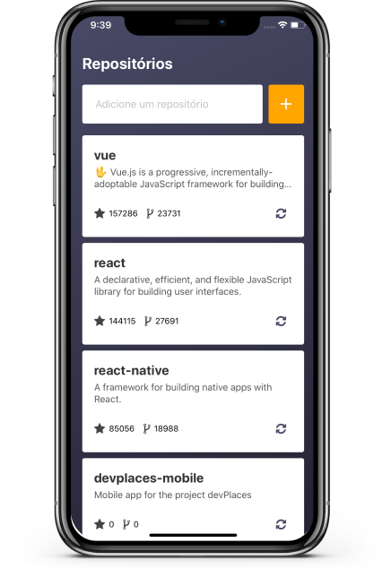

[](https://opensource.org/licenses/MIT)
[](https://standardjs.com)

# reactnative-realm-repositories

Just a simple app to add github repositories and storing them using RealmDB. Thanks to Rocketseat for the amazing content about react native.




## Installation

Clone the project

  ```bash
  git clone https://github.com/rafaelcalhau/reactnative-realm-repositories.git myproject
  ```

Navigate into the project folder

  ```bash
  cd myproject
  ```

Install all dependencies using the NPM or YARN

  ```bash
  npm install # or yarn
  ```

  ```bash
  cd ios # go to ios project directory
  pod install # install the pods
  cd .. # back to project root
  ```

## Usage

Development start:

  ```bash
  npm run start # or yarn start
  ```

  Run on IOS:

  ```bash
  npm run ios # or yarn ios
  ```

  Run on Android:

  ```bash
  npm run android # or yarn android
  ```

## License
[MIT](https://choosealicense.com/licenses/mit/)